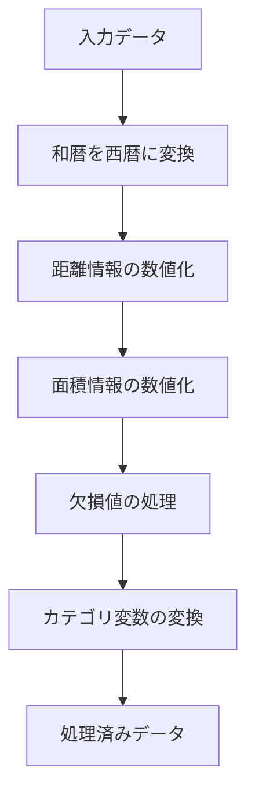
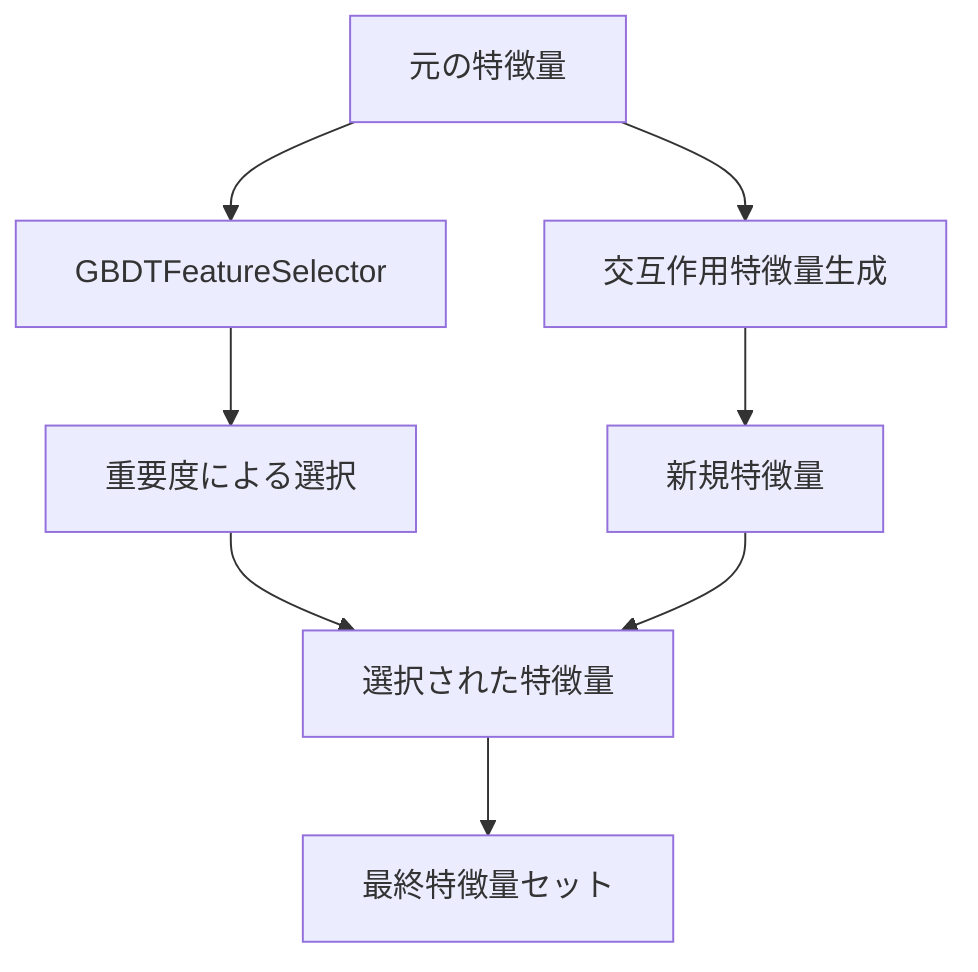
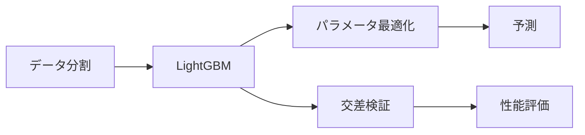
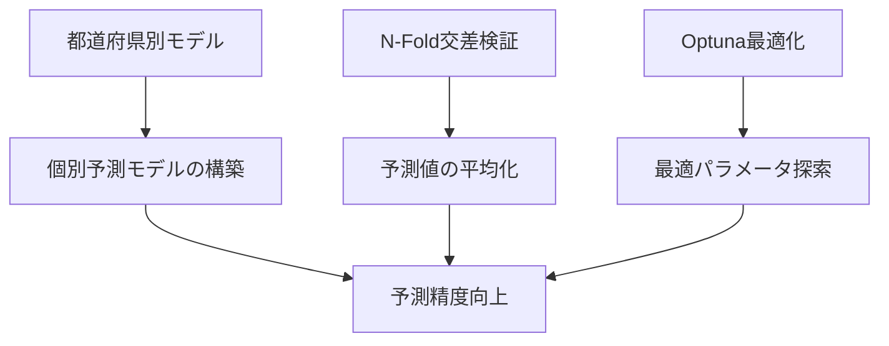

# このフォルダのプログラムについて

このフォルダのmainプログラム(main.py)は、以前に機械学習AIの勉強を兼ねて、コンペでのアパート価格予測データを題材にして、LightGBMモデルで価格予測を行うものになります。 
(※optuna等のライブラリーはバージョンが変わっているので、このコードは改めて組み直す必要はあります。)

## 概要
<!-- ---
marp: true
theme: default -->
---

# 不動産価格予測システム
- データ分析と機械学習を用いた不動産価格予測プログラム

---

# プログラムの主要機能

1. データの前処理と加工
2. 探索的データ分析(EDA)
3. 特徴量選択
4. モデル構築と予測
5. 外部データの活用

---

# データ前処理の主な内容

---

# 探索的データ分析(EDA)の内容

- 都道府県別のレコード数分析
- 都道府県別の平均取引価格分析
- 市区町村別のデータ分析
- 間取り情報の分析
- 面積当たりの価格分析
- 最寄駅距離の分析
- 特徴量間の相関分析

---

# 特徴量選択と生成

- xfeatライブラリによる特徴量選択
- 重要度閾値：0.75
- ペアワイズ交互作用特徴量の生成

---

# モデリングと予測手法

- LightGBMを使用した回帰モデル
- Optunaによるパラメータ最適化
- K-Fold交差検証による性能評価

---

# 外部データの活用

1. 駅別データ
   - 駅名と価格情報
   - 乗降客数情報

2. 地域別データ
   - 住居表示と価格情報
   - 地域特性データ

---

# 予測精度向上のための工夫

1. 都道府県別の個別モデル構築
2. N-Fold交差検証による予測の安定化
3. Optunaによるハイパーパラメータの最適化

---

# 評価指標と出力

- 評価指標：MAE（Mean Absolute Error）
- 出力形式：CSV形式の予測結果
- 特徴量重要度の分析結果
- 都道府県別の予測精度

<!-- 

 -->

## 内容

main.pyで実装している内容は下記になります。 

- EDAでデータの内容を把握する
- 前処理で学習データの分割や、データ型をカテゴリカルや数値に変換する
- LightGBMモデルで価格予測する、もしくはoptunaでパラメータを最適化したLightGBMモデルで価格予測する
