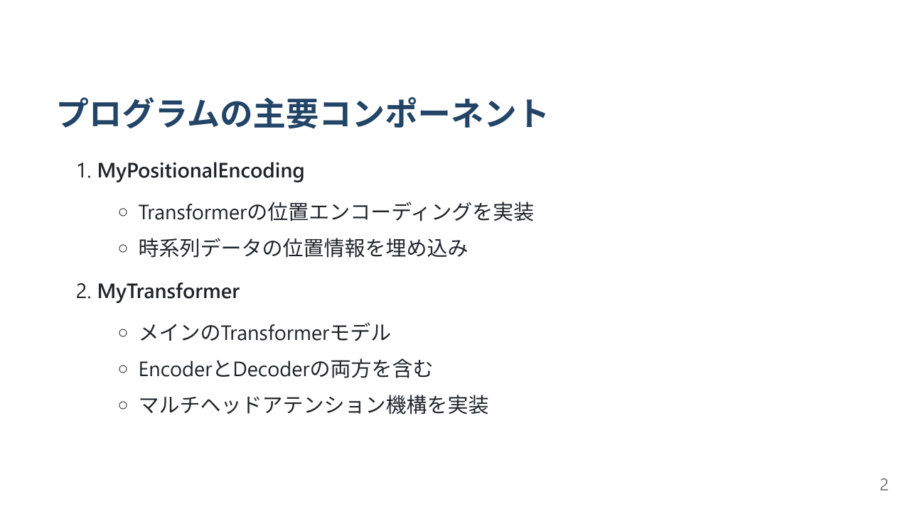
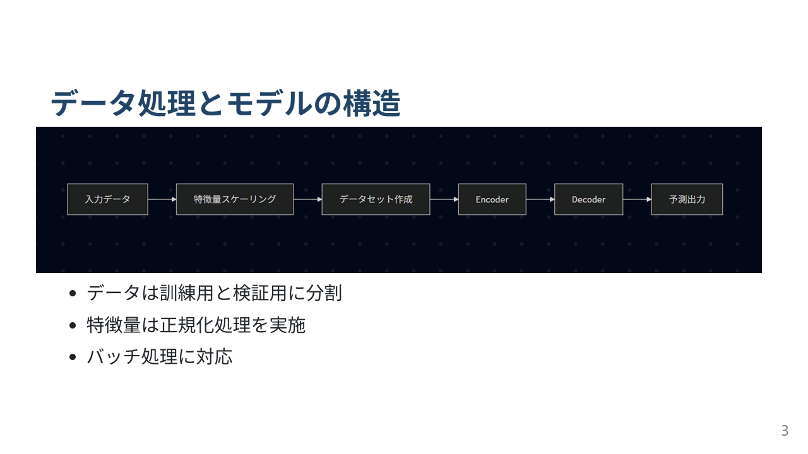
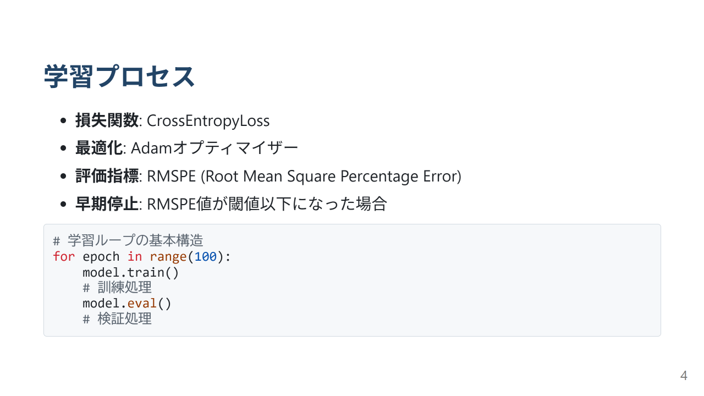

# このフォルダのプログラムについて

このフォルダのmainプログラム(main.ipynb)は、以前にtransformerアーキテクチャーの勉強を兼ねて、コンペでの野菜価格予測データを題材にして、pytorchでtransformerのモデルを組んだものになります。

## 概要

## 詳細

main.ipynbで実装しているクラスや関数は下記になります。 

1. 関数scaling_per_feature &nbsp;⇒データを各特徴量毎にスケーリング(正規化)するための関数。関数data_preprocessから呼ばれる。
2. クラスMyDataset &nbsp;⇒入力データをデータセットに変換するためのクラス。関数data_preprocessでインスタンス化されて用いる。
3. 関数data_preprocess &nbsp;⇒入力データを前処理するための関数。
4. クラスMyPositionalEncoding &nbsp;⇒Positional Encodingを行うためのクラス。クラスMyTransformerでインスタンス化されて用いる。
5. クラスMyTransformer &nbsp;⇒Transformerモデルを作るためのクラス。
6. 関数rmspe &nbsp;⇒評価関数RMSPEの値を求めるための関数

実装したTransformerモデルのEncoder側の入力の特徴量は「価格」と「数量」の2つで、Decoder側の入力の特徴量は「価格」の1つになります。
